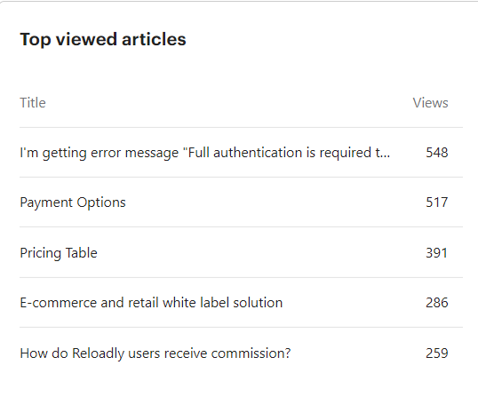

2021 has been a hell of a year! 

&nbsp;

**Customer Support**

&nbsp; 

We already had Moesif at the beginning of the year, and ramped up on alarms, graphs and we now have an extensive and detailed NOC that helps us detect any downtime within minutes of happening.

  

It wasn’t until April this year that we had 3 engineers in the Nigeria team to be able to handle the full workload and do the different shifts. Also Irene came and took over the routing responsibilities, testing, logging and updating data bundle information, removing Samuel’s bottleneck. This has been the year that we updated all bundle information finally into the API!

  

2021 has been the year of registering in our Confluence space all our processes and tools, creating a more streamlined support that has allowed us to reduce our first response time down from 30mins to 3mins some weeks, and always below 5mins,  (90% improvement) and reducing our time to close from 50mins at the beginning of the year down to 9 minutes (82% improvement).

We have done a great job improving the quality of our Help Center and adding articles for every new question or product feature we released, including security, SDKs, giftcards, etc which has taken the self served support from 46.2% to 79% (71% improvement).

  

We received 5200 visitors (412% increase) at our Help Center with a total number of article views of 12343 (277% increase)

  
&nbsp;

Our top viewed articles in 2021 were:

&nbsp; 

- During Q4 we’ve taken customer service to the next level becoming omnichannel, attending our customers wherever they are, be it facebook, whatsapp, twitter, email or chat.

  

- 69% seeking support through email, 24% via chat and now 7% via whatsapp. Chat users are now offered the possibility to continue the conversation in whatsapp so we can close tickets even faster now.

  

- Our monthly active users have moved from 165 to 270 in airtime and from 0 to 28 in giftcards.

- And we have experienced a major increase in transactions from 188454 to 355344, which is almost 200% 

  

- Thus, the number of people actively seeking support has increased from 119 up to 685 (575% increase). 

  

- We’ve received 8478 new conversations from users and leads that’s a 300% increase from previous year.

  

- Busiest periods for new conversations are Saturday at 4pm CET, Sunday at 3pm CET, Mondays and all week days at 6am and 6pm.

  

- Even with this increase we managed to keep customer satisfaction high and increase it from 85.7% up to 92% (6.3% improvement)

  

- We have implemented Bender, which has increased by 80 the daily cases that the team need to check, however this has reduced the number of disputes received.

&nbsp;

The top conversation tags are: 

- 31% topup-successful

- 20% XTRANSFER

- 26% refund transaction

&nbsp;

**SDR**

  

- During this year, we ran a pilot for outbound lead generation and it has been a great success populating Sales funnel with 63 leads in Early Engagement, 20 in Negotiation and 6 in Integration phase.

  

- We’ve seen great results implementing SDR campaigns for trade-shows, especially starting a few days before the event, creating awareness and booking meetings during the event and post event.

  

- We’ve also completed the whitepaper campaign, the topup campaign and the incentives and rewards campaign.

  

- Luis has proven very valuable helping Account Managers land key meetings, such as Keep Calling.

&nbsp;

**Onboarding**

  

- During this year, we ramped up the onboarding of registered accounts, and we have since created the following key account qualified deals for the sales team: 81in early engagement, 16 in negotiation and 4 in newly live.

  

- Besides that, we have onboarded the following tier 2/3 accounts: 318 in Early conversation, 125 demo scheduled, 111 demo done, 56 in integration and 15 fully onboarded.

  

- We have also started doing weekly onboarding webinars both in English and French to help our newly registered users, already delivered 6 webinars.

&nbsp; 

**Retention**
  

- Retained Average revenue rate of over 90.2% monthly.

- Expansion Average revenue rate of 13.78% monthly.

- Resurrected Average revenue rate of 0.23% monthly.

- New Average revenue rate of 0.50% monthly.

&nbsp;

**Community**

- We have started doing weekly community meetings between Marketing, Developer Advocacy and Customer Success to map next steps in this area. We are planning to launch a pilot in Nigeria targeting university students with a hackathon and engaging ambassadors locally.
  

- We are also discussing implementing certifications for developers to increase brand exposure.

- The Developer community data is as follows:

  
    - 5203 total messages sent in Reloadly Developers community

    - 262 members

    - 50 average active users weekly

&nbsp;  

Improvement Opportunities
-------------------------

- Integrate one skype group for support only, less errors, more streamlined support.

- Complete one whatsapp number integration for key account support, stop using personal phones.

- Complete career path and certification program for Customer Support team: include more soft skills

- Increase self-served ratio by improvements on Help Center

- Reduce disputes proactively working with Bender

- Reduce traffic loss due to lack of balance in wallet - new notifications and reports, Bender

- Automate testing for provider status daily

- Load A-Z product list for each provider

- Complete routing process mapping

- Improve speed of integration for new accounts

- Improve tracking throughout integration process

- Create SDR team (based locally in each region)

- Create more compelling success stories per industry and product

- Share SLA in negotiation phase, reduce timeout conciliation issues

- Hire more Tech Support Specialists to cover 24/7

- Data consistency across platforms and syncing

- Data insights on our customers usage to help them grow faster

- Create Retention team

&nbsp;

2022 Plan
---------

&nbsp;

  

**Customer Support**

| **Focus Area** | **ETA** | **Impact** |
|------|------|------|
|  Cover Americas shift     | 2022 Q1     | Provide 24/7 support and accommodate the Americas load     |
| Cover APAC shift     | 2022 Q1     | Provide 24/7 support     |
| Career Path and Certification Program      |   2022 Q1   | Include new soft skills training to ramp up CSAT scores above 95%     |
| Spend 1 day per quarter at CS     |  	2022 Q1    | Become a customer centric company     |
| Complete Routing Process     | 2022 Q1 Ongoing     | Eliminate downtimes due to routing errors      |
| Track and share Delivery Quality metrics     | 2022 Q1 Ongoing     |  Create a new Key advantage for sales team    |
|      |      |      |

&nbsp;

**SDR**

&nbsp;

| **Focus Area** | **ETA** | **Impact** |
|------|------|------|
|   Hire new regional SDRs   | 2022 Q1     | Provide new leads to account managers     |
|  Map all SDR processes    | 2022 Q1     |  Better ramp up SDR learning curve    |
| Awareness campaigns for Crypto, Remittances and Tradeshows     |  2022 Q1    | Increase new leads to account managers     |
|      |      |      |

&nbsp;

**Onboarding**

&nbsp;

| **Focus Area** | **ETA** | **Impact** |
|------|------|------|
|   Map integration process for key accounts   | 2022 Q1     |  Fast track key accounts to live status    |
| Automate onboarding processes      |  2022 Q1    |  Be able to scale onboarding    |
|  Hire America and APAC Onboarding specialists    |  2022 Q1    | Availability for onboarding support 24/7     |
|   Implement Integration meeting   |2022 Q1      | Fast track key accounts to live status     |
| Improve webinar quality and material      | 2022 Q1     | Be seen and recognised as pros     |
|       |       |

&nbsp;

**Retention**

&nbsp;

| **Focus Area** | **ETA** | **Impact** |
|------|------|------|
| Prepare QBR user metrics dashboard      | 2022 Q1      |  Increase expansion revenue    |
|  Create QBR process with Sales     |      |   Increase expansion revenue   |
|  Complete Customer Journey Map, Ad-hoc messaging and Sequences    |  2022 Q1    | Increase both activation and expansion revenue, reduce traffic loss     |
| Start tracking expansion revenue rate     | 2022 Q1     | Increase expansion revenue     |
| Hire Retention Team     | 2022 Q1     | Detecting traffic loss and recovering it faster  Increase expansion revenue     |
| Create new compelling success stories     |  2022 Q1    | Lure more clients with compelling use cases     |
|       |       |

