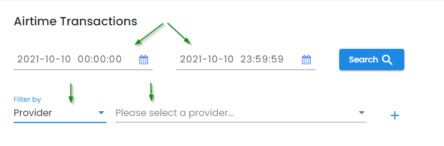
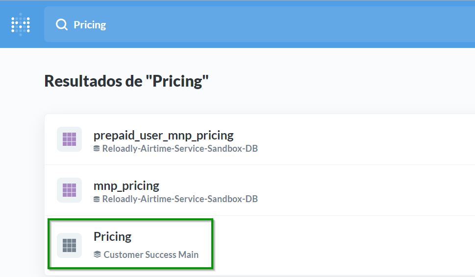

&nbsp;

Finance Handbook
================

The Finance department focuses on responsibilities such as financial accounting, reconciliation, payroll, estimating and handling cash in- and outflow; and also pricing management and pricing reconciliation.

&nbsp;

Responsibilities
----------------

_What are the roles/positions currently in place in the Finance organization, and what are their responsibilities?_

*   _**Bookkeeping**_**:** It involves the day-to-day recording, analysis and interpretation of a company’s financial transactions. This will include the tracking of all expenses (purchases, payments etc.) and sales of finished products.
    
*   _**Management of company’s cash flow:**_ to manage all cash flows into and out of the companies and ensure that there are enough funds available to meet the day-to-day running of the company.
    
*   _**Reporting and Financial Statements:**_ to prepare financial reports that can be used for budgeting, forecasting and other decision-making processes. In addition, these and other reports are needed for communication to investors, banks and other professionals that play a role in the growth of our business.
    
*   _**Financial Controls:**_ Includes provider and customer reconciliations.
    
*   _**Payroll managemen**t:_ includes making sure all employees are paid accurately and timely.
    
*   _**Pricing management:**_ includes audit and reconcile pricing, update provider and customer pricings, and improve pricing.
    

_**Fund Raising:**_ Researching potential investors, writing funding proposals, maintaining records of investors.

&nbsp;

Correspondence Responsibilities
-------------------------------

*   Please use the **#finance** channel in Slack for submitting top-up requests and questions related to finance.
    
*   Accounts Payable: inquiries which relate to vendor and merchant invoices, should be sent to our Finance mailbox – [finance@reloadly.com](mailto:finance@reloadly.com). You can also reach the Finance team on Slack in the #finance chat channel. Invoices that require payment processing should be also sent to [dperrin@reloadly.com](mailto:dperrin@reloadly.com).
    
*   Billing Operations: Customer billing inquiries should be sent to our Finance mailbox – [finance@reloadly.com](mailto:finance@reloadly.com) or to the Billing and Pricing Analyst.
    
*   Accounts Receivable: Customer payment/remittance inquiries should be sent to our Finance mailbox – [finance@reloadly.com](mailto:finance@reloadly.com) or to the Billing and Pricing Analyst.
    
*   Payroll: inquiries which relate to contractor invoices should be sent to our Finance mailbox – [finance@reloadly.com](mailto:finance@reloadly.com) or to the Finance Manager
    
*   Reimbursement Requests: Team member's expenses should be sent via Factorial to the Finance Manager.
    
&nbsp;

Provider – Accounts Payable
---------------------------

Welcome to Accounts Payable, commonly referred to as AP. You should be able to find answers to most of your questions in the sections below. If you cannot find what you are looking for, then please connect with us:

\- Slack Channel: #finance
- Email: finance@reloadly.com

&nbsp;  

Accounts Payable Procedure
--------------------------

On a daily basis, the finance department will check and record Reloadly’s wallet of each prepaid provider to monitor and send the necessary payments to have enough balance for the transactions in a certain period.

The amounts shall be recorded in USD. In case the prepaid wallet is in a different currency, the amount will be converted using the official FX rate of the day.

Currently, the prepaid providers are:

|**Provider Name**   |   |   |   |
|---|---|---|---|
| AFRIKPAY | CV_MOVEL1    | MERCHANT_TRADE  |  SMARTFREN1   |
|AIRTEL_CONGO_BRAZZAVILLE1    | CY_SEND   | MOVITEL  | SOCHITEL  |
| AIRTEL_NIGERIA  |DIGICEL   | MTN_GUINEA_BISSAU  | TELKOM_KENYA  |
| AIRTEL_TIGO_GHANA1   | 	DNS1    |MTN_IVORY_COAST2    | TENYING  |
| AIRTEL_UGANDA1   | ECONET1   |NINE_MOBILE   |TIGO_GUATEMALA   |
| ATI1/2   | ECPAY3   | NSANO  |TRANGLO   |
| BANKAI  | ETHIOTEL  |ONATEL   | TRANSFERTO  |
| BUTTON_PAY   | GAM_SWITCH  | PALTEL  |UNITEL1    |
| CLARO_DR  |HUTCHISON   | PAYMENT_SOURCE  |VODACOM_DRC   |
| CLICKMOBILE  |IDT3    | PRIME  | VPS3   |
|CONVERGED   | INTOUCH  (Mali / Burkina Faso)   |PULSA_PRO   | WORLDVOICE  |
| CSQ Europe routes   | KEPLER1   | QCELL  |	XTRANSFER    (Senegal, Mali, Comoros, Ivory Coast, Somalia, Madagascar, Lebanon)   |
|CSQ Cuba routes   | LAFRICAMOBILE  (Mali / Senegal)    | SAFARICOM1    | ZERO_SEVEN1   |
|       |       |       |       |

&nbsp;

1 Provider with no portal. 

2 The provider sends an email with the balance to [finance@reloadly.com](mailto:finance@reloadly.com) 

3 Needs VPN

To check the balance of each provider, go to the provider´s portal and get the balance in our wallet. In case that the currency is not USD, go to [http://xe.com](http://xe.com) to convert the amount. The information of all the providers´ portal can be find in confluence: 

Once we have the balance in USD, open the next file and add the balance of that day. 

[https://docs.google.com/spreadsheets/d/1W5pZY\_rzhq3pibv6o\_6MR\_yxj1PLK-6PFgGE5B1OsJs/edit#gid=0](https://docs.google.com/spreadsheets/d/1W5pZY_rzhq3pibv6o_6MR_yxj1PLK-6PFgGE5B1OsJs/edit#gid=0)

  
&nbsp;

## Payments

&nbsp;

The amount to be sent to the provider should cover at least one week of transactions.

For calculating the amount of the payment, go to Admin 🡪 Reports 🡪 Airtime management and search specific dates and filter by provider and analyze if the balance is enough for the week / or after the weekend, and in case of sending some funds check how much will be needed. 

It is very important to consider how long it takes for a provider to get the payment and add the funds in our account; also determine if there is a holiday in the provider´s country and if there is a holiday in the countries where we have the bank accounts. 

  
| **Provider Name**  |   |   |   |
|---|---|---|---|
|AFRIKPAY2    | CV_MOVEL  | MERCHANT_TRADE2   | SMARTFREN  |
|AIRTEL_CONGO_BRAZZAVILLE4   | CY_SEND1   | MOVITEL  |SOCHITEL1     |
| AIRTEL_NIGERIA  | DIGICEL3  | MTN_GUINEA_BISSAU  | TELKOM_KENYA2  |
| AIRTEL_TIGO_GHANA  | DNS  | MTN_IVORY_COAST4  | TENYING2   |
| AIRTEL_UGANDA  | ECONET  | NINE_MOBILE  |TIGO_GUATEMALA3   |
|ATI2   | ECPAY3   | 	NSANO  | TRANGLO2    |
| BANKAI2  | ETHIOTEL2  | ONATEL  |TRANSFERTO1   |
| BUTTON_PAY2  | GAM_SWITCH4  | PALTEL  |  UNITEL  |
|CLARO_DR2   | HUTCHISON  | PAYMENT_SOURCE1   |VODACOM_DRC   |
| CLICKMOBILE2  |  IDT1  | PRIME  | VPS2  |
|CONVERGED2   |INTOUCH3     (Mali / Burkina Faso)   | PULSA_PRO2  | WORLDVOICE   |
|CSQ Europe routes1    | KEPLER  | QCELL3   | XTRANSFER4    (Senegal, Mali, Comoros, Ivory Coast, Somalia, Madagascar, Lebanon)  |
|CSQ Cuba routes1    | LAFRICAMOBILE (Mali / Senegal)3   |SAFARICOM   | ZERO_SEVEN  |
|   |   |   |   |

1 Same day 

2 Next day

3 Two days

4 Between 3 - 5 days

&nbsp;

The payment can be sent from different bank accounts based on the currency. Finance will send the top-up request to the provider adding in copy the account manager and attaching the proof of payment. The contact details of the following team members shall be added to the email as well:

*   Chief Executive Officer
    
*   Finance Manager
    
*   Billing and Pricing Analyst
    
*   Staff Accountant
    
*   Associate Product Manager
    

Also, anyone from the customer success team (Technical Support department) can be added to the email.

&nbsp;

## Reconciliation  

-----------------

*   Post-paid providers
    
    Postpaid providers: the supplier provides Reloadly with a line of credit, and payment terms. Every Monday, the provider sends Reloadly an invoice report weekly, for transactions received by them in the prior period from Monday to Sunday.
    
    After receiving the transaction report and the weekly invoice, finance team will reconciliate the invoice before making the payment. The reconciliation shall be done within 2 business days.
    
    The discrepancies cannot be greater than 1%. Otherwise, Reloadly will open a dispute with the provider and the company will deduct those transactions from the weekly payment until the is resolved.
    
*   Pre-paid providers
    
    Finance team will record the prepaid balance of each prepaid account every day.
    
    On the other hand, Finance will make weekly reconciliations of each prepaid wallet to guaranty the discrepancies are below 1%. If they exceed the 1%, the Reloadly will open a dispute with the provider.
    
    For the reconciliation, two databases are needed:
    
    *   Provider transactions: Go to each provider´s portal and download the information.
        
    *   Reloadly transactions: For the reconciliation it’s necessary to download the raw sales data from Metabase.
        

After we get all the information needed, the information must be copied in the next file:

[https://docs.google.com/spreadsheets/d/1TciKPYuRZP3z6e0DzmGKE4Z8M7SM-GW2/edit?usp=sharing&ouid=114234325862489448449&rtpof=true&sd=true](https://docs.google.com/spreadsheets/d/1TciKPYuRZP3z6e0DzmGKE4Z8M7SM-GW2/edit?usp=sharing&ouid=114234325862489448449&rtpof=true&sd=true)

The maximum difference between the transactions in Reloadly database and the provider's portal must be 1%. If the difference is greater than 1%, then Reloadly will open a dispute with the provider.

Otherwise, Finance will open a dispute with the provider.

To attend the dispute properly, Finance will make a second reconciliation identifying those transactions registered in the system and the transactions not registered in Reloadly database. Support team will provide the log of the transactions if it’s necessary.

&nbsp;

Customer – Account Receivable
-----------------------------

Welcome to Accounts Receivable, commonly referred to as AR. You should be able to find answers to most of your questions in the sections below. If you cannot find what you are looking for, then please connect with us:

*   Slack Channel: **#finance**
    
*   Email: [finance@reloadly.com](mailto:finance@reloadly.com)
    
&nbsp;

Invoicing
---------

*   Postpaid customers: Every Monday Reloadly sends the previous week invoice together with the transactions report for the corresponding period to its post-paid customers.
    
*   For prepaid Customers: Reloadly will send a monthly invoice, only for customers who request it.
    

&nbsp;

Period
------

The invoice must comprise all previous week, from previous Monday to last Sunday (7 days). In case of prepaid accounts, the from the 1st to the last day of the month.

[Finance Team Invoicing Period](../images/finance-team-invoicing.jpg)

On Monday 11th Reloadly sends one invoice to each customer for the period from 4th to 10th.

If during this period of time there are 2 different months, we will divide the transactions and will issue 2 different invoices for each month.

[Finance Team Invoicing Period](../images/finance-team-invoicing-2.jpg)

On Monday 4th, Reloadly would need to issue two invoices to each customer:

*   1st invoice: from 28th to 31st
    
*   2nd invoice: from 1st to 3rd
    

Both invoices are sent in the same email at the same time.

  
&nbsp;

## Post-paid Customers

The post-paid customers to which invoices must be sent every week are:

| User ID  | Customer   | Sales Team  |
|---|---|---|
| 1194  |CSQ   | Jean-Olivier Buteau  |
| 1543 / 1542  | Edimm  | Jean-Olivier Buteau  |
| 3423  | Nobel  | Tulita Cartagena   |
| 3497  |Pure Minutes   | Jean-Olivier Buteau   |
| 3722  |Senditoo   | Sam Herring |
| 2601   | Amerimex  | Tulita Cartagena  |
| 5226   |UPM   |  Jean-Olivier Buteau   |
| 7548  | Paymaster  |Jean-Olivier Buteau   |
|   |   |   |

_The above list might vary, customers might be added or deleted._

&nbsp;

Invoicing Process
-----------------

On Monday morning invoices must be created in Admin. Once the invoice is created, it must be checked before sending it by email to the customer.

*   Go to **Admin > Reports > Invoice Report**
    
*   In this screen there is a list of invoices previously created, you can filter by: date (issue date, when the invoice was created).
    
*   To create a new invoice, click on **Generate Invoice** (blue button)
    
*   Add the details:
    
    *   Start date: Monday of last week.
        
    *   End date: last Sunday.
        
    *   User ID: enter the user ID you want to issue the invoice to (ex: 1194).
        
    *   Note: brief description, write the transaction period of the invoice (ex: From Jan 4th to Jan 10th)
        
*   Click on **Submit**.
    
*   In case the client does not have transactions for that period, a message will appear in Admin, and the designated number will not be used for another invoice.
    
*   If you filter by today’s date, you will see the invoice created:
    
*   Download both the invoice (in HTML format) and the spreadsheet (Excel), this last one is the transaction report for the specific period, which also is sent to the customer.
    
*   Save them in the following Drive folder: **20\. Finances > 11. Vendors & Customers > Customers (+) >** in the corresponding customer folder.
    
*   For each customer, there must be a folder for the corresponding month and week. That needs to be created. [https://drive.google.com/drive/folders/12p8SigFJv3IxTlFq\_jMUEcdBPtffq1A](https://drive.google.com/drive/folders/12p8SigFJv3IxTlFq_jMUEcdBPtffq1A) \_
    

&nbsp;

Invoice Check
-------------

Once the invoice has been created, a check shall be done to verify everything is correct and the information from the spreadsheet with the transactions matches the information in the invoice. Below are the checks to do:

*   Verify that there are not duplicated transactions. (check transactions ID)
    
*   Verify that the sum of the **“Amount”** in the spreadsheet coincides with the Subtotal of the invoice.
    
*   Verify that the sum of the **“Discount”** in the spreadsheet coincides with the Total discount of the invoice.
    

If something is wrong a manual invoice will have to be done. Before sending the invoice, the html file needs to be converted into PDF. For that, the best online tool is [Sedga](https://www.sejda.com/html-to-pdf). There is an account to be able to convert several invoices at the same time. Save the PDF in the same drive folder where the html and the excel were saved. You will need approval from a member of the finance team for this.

When sending the invoice by email to the customers we will send both the transactions report (Excel) and the PDF invoice.

&nbsp;

Credit Note
-----------

*   Before sending the invoice, it is important to check if the client has any transaction disputed and reviewed by the Customer Support department.
    
*   Every prepaid customer has its own sheet.
    
*   If a client has any transaction on that file, it is necessary to create a credit note.
    
*   The information that is necessary is:
    
    *   Client's name and email. Number of the credit note.
        
    *   Date of the credit note.
        
    *   Period of the transactions
        
    *   Date of the transaction, transaction ID, operator name, and the net amount (amount - discount).
        

Finally, to send the invoice - send an email to each of the post-paid customers attaching the PDF of the invoice and the Excel file (transaction report).

&nbsp;

Funding Process
---------------

### Post-paid customers

The customer shall go through a selection process. Finance will study the case and request any additional documentation related to the selection process such as financial statements, cash flows projections, among others. After the initial valuation, if Reloadly decides to continue with the process, the customer shall sign the API Reseller Agreement and submit the credit application form. Under no circumstances Reloadly will give more than two of transactions as a credit line to the customer.

Finance team will generate and send to the customer an invoice report weekly, on Mondays for transactions received by the customer in the prior period from Monday 12:00:01 am to Sunday 12:00:00pm. The customer will submit payment to Reloadly by wire transfer for the invoice amount due at each time the invoice is issued within 2 business days.

If at any time prior to each invoice date, the customer account balance reaches an amount above the customer credit line and/or deposit, Finance team will generate and send to the customer an invoice and Top Up usage report to that date and time and the customer will submit payment to Reloadly by wire transfer for the invoice amount. Payment for invoices must be made to Reloadly within 2 business days of receipt. The account manager will be in copy in the emails among with the rest of the finance team.

The account manager will inform the Finance team within enough time when the customer increases the traffic.

Finance team will manually update the credit line once the payment is cleared.

  
&nbsp;

### Pre-paid Customers

Reloadly will credit customer’s accounts once the payment is cleared. However, there are some specific cases when Reloadly credits their account in advance once the customer sent proof of payment.

The prepaid customer will either raise the request to Support team, who will contact the finance team via Slack (finance channel) or send the proof of payment via email to [finance@reloadly.com](mailto:finance@reloadly.com)

The non-successful transactions are refunded directly to the customer wallet after checking the status of it. Support team will verify if the transaction was successful or not and they will credit the customer account if needed. All the refunds above 100 USD will be applied by the finance team.

&nbsp;

Payments
--------

Finance will only apply payments only on working days, from 9am to 7pm (CET).

There are 4 different options to the clients:

*   Credit Card: The client can use this option to add funds automatically to its account. The funds are added automatically. To use this method the client must send less than 5,000 USD monthly, due to the fees that the platform Stripe charges the company. If the customer sends more than 5.000 USD monthly via stripe, Reloadly can deduct the fees from the customer account.
    
    The Finance team does reconciliations with the payments send via Stripe and in case a client sends more than 5,000 USD monthly and tells the account manager to inform the client that according to Reloadly payment policy the payments need to be sent via wire transfer, to avoid any deduction due to credit card commissions.
    
*   PayPal: The customer must send the proof of payment to the customer support team when they send funds via PayPal. Customer Support will send the request via slack to the Finance team among the proof of payment and the account ID or customer email.
    
    Reloadly will credit the customer wallet for the net amount received. Reloadly won’t apply funds if the status of it is pending.
    
    In case of a new account, the account manager will confirm the veracity or the payment and the customers before crediting customer’s account.
    
*   Wire transfer: Reloadly have different banks to get payments from the clients. There are many options to send a payment according to the client´s currency.
    
    *   Chase Bank: for payments in USD (USA). Only for USA account Reloadly also gets payments via Zelle.
        
    *   Caixa bank: for payments in Euro or Pounds (Europe).
        
    *   TransferWise
        
    *   Bank account: Pounds (UK).
        
    *   National Bank: for payments in CAD (Canada)
        
    *   Standard Bank: for payments in ZAR (South Africa).
        
    *   Zenith Bank: for payments in NGN (Nigeria)
        

Finance team will be notified in the finance channel in slack by the Customer support team or the AM, to add the funds to the customer. Finance team will manually add the net amount received.

Customers can also send the proof of payment via email to [finance@reloadly.com](mailto:finance@reloadly.com) and the Finance team. The funds must be added after the payment is confirmed and received in the bank account.

*   Cryptocurrencies (Bitcoin): When Reloadly gets a payment in cryptocurrency, the amount added to the client´s account is according to how much we get when it´s sell. Finance team will credit customer account for the net amount received after converting the Bitcoins to USD. The proof of payment will be sent via Slack to the finance team.
    

The payment options can be found in Reloadly´s web page: [https://faq.reloadly.com/en/articles/2355823-payment-options](https://faq.reloadly.com/en/articles/2355823-payment-options)

&nbsp;

Reconciliation
--------------

Finance will send a weekly invoice and a transaction report every Monday for the transactions received by the customer in the prior week (Monday to Sunday). The customer will submit the payment to Reloadly for the invoice amount due at each time the invoice is issued withing 4 business days. Once the payment is cleared, finance will proceed to update the credit line that Reloadly is providing to the customer.

Finance records the payments and summaries of each postpaid customer in the following file:

[https://docs.google.com/spreadsheets/d/1-JurQ7CGvDgpA\_955Z4rPAMXndY2SqsIUuHnjxoqiR4/edit#gid=0](https://docs.google.com/spreadsheets/d/1-JurQ7CGvDgpA_955Z4rPAMXndY2SqsIUuHnjxoqiR4/edit#gid=0)

In case the customer opens a dispute, the support team will attend it and communicate with Finance whether to send the customer a credit note. The credit note will be deducted from the invoice weekly payment.

Reloadly credit to the customer account once the payment is cleared. However, there are some specific cases where it is necessary to do a weekly reconciliation. Reloadly credit their account in advance and in some cases regardless of whether the customer sends proof of payment.

The following file is to record all advances given to each prepaid customer.

[https://docs.google.com/spreadsheets/d/10RplmOe0K1w93A0ZndkHM-hSGPkaPG44wwLIh3zw2eU/edit#gid=0](https://docs.google.com/spreadsheets/d/10RplmOe0K1w93A0ZndkHM-hSGPkaPG44wwLIh3zw2eU/edit#gid=0)

However, every customer has a file with the summary:

*   Payments added in Admin.
    
*   Payments received in the bank account
    
*   Payments in cash.
    

The files can be found in the next link:

[https://drive.google.com/drive/folders/16V05Wi1zOqt0Ftt5vjHGZwYWI6n3pHRF](https://drive.google.com/drive/folders/16V05Wi1zOqt0Ftt5vjHGZwYWI6n3pHRF)

Finance will reconcile the accounts every week. Finance won’t give more than two advances if the previous payments didn’t arrive, or the lasted payment takes more than two days to arrive.

&nbsp;

Pricing
-------

There are different categories of clients: customers with a standard pricing and customers with custom pricing. The default pricing from A to Z applies for all the customer in general. However, some customers have custom pricing.

For pricing there are 3 components we need to consider:

*   FX for international top-ups
    
*   Discount
    
*   Deductions / Fees
    

The Finance team is responsible for keeping the information updated. However, the account managers are responsible for making the pricing and for what they offer to customer as a custom pricing.

&nbsp;

Provider Pricing
----------------

Currently Reloadly works with 54 active providers. (This number is to be updated over time)

&nbsp;

| Provider Name  |   |   |   |
|---|---|---|---|
| AFRIKPAY2  | DIGICEL1  | MTN_IVORY_COAST2  |TELKOM_KENYA2  |
| AIRTEL_CONGO_BRAZZAVILLE2 | DNS2  | NINE_MOBILE2  | TENYING2  |
| AIRTEL_NIGERIA2   | ECONET2  |NSANO2   |TIGO1   |
| AIRTEL_TIGO_GHANA2  | ECPAY2  | ONATEL2  | TIGO_GUATEMALA1  |
| AIRTEL_UGANDA2  | ETHIOTEL2  | ORANGE2  | TRANGLO2  |
| ATI2  |GAM_SWITCH2   | PALTEL2  | TRANSFERTO1  |
| BANKAI1  | HUTCHISON2  | PAYMASTER1  | UNITEL2  |
| BUTTON_PAY2  |IDT1   | PAYMENT_SOURCE2  | VODACOM_DRC2  |
| CLARO_DR1  | INTOUCH2  |PRIME2   | VPS2  |
| CLICKMOBILE2  | KEPLER2  | PULSA_PRO2  | WORLDVOICE2  |
| CONVERGED2  |LAFRICAMOBILE2   | QCELL2  | XTRANSFER2  |
| CSQ1  | MERCHANT_TRADE2  | SAFARICOM2  | ZERO_SEVEN2  |
| CV_MOVEL2  | MOVITEL2  | SMARTFREN2  | GLO_NIGERIA3  |
| CY_SEND2  | MTN_GUINEA_BISSAU2  |SOCHITEL2   | PRASAN3  |
|   |   |   |   |

&nbsp; 

1 Cannot control the FX

2 Can control the FX

3 Disabled

&nbsp;

Customer Pricing
----------------

There are 2 main categories of customers, the ones with standard pricing and the ones with custom pricing. For the second option, there are different types of clients, and this impacts on how aggressive the pricing can be:

*   Tier 1: Sales  From 1 million per year.
    
*   Tier 2: Sales  From 100,000.00 USD per year.
    
*   Tier 3: Sales  From 10,000.00 USD per year.
    

For a Custom pricing the clients must project/send over 10,000 USD per month, otherwise, the pricing will be updated to the standard.

  
&nbsp;

### Custom Pricing Procedure

Each Account Manager oversees the pricing for their customers. They make the pricing proposal according to the information we have in Admin and in Metabase: To get the providers information, go to the company's Metabase account, search _**“Pricing”**_ and download the file to be able to see what the 54 providers offer for all the operators we have integrated.

Before starting with a custom pricing, is necessary to get from the customer the next information:

*   Volume per year.
    
*   Top 5 countries.
    
*   Products they are interested in:
    
    *   Airtime
        
    *   Data
        
    *   Bundles
        
*   Their current pricing in case they have another provider.
    
*   What they are interest in:
    
*   Better FX rates.
    
*   Better discounts.
    
*   A mix FX/Discount.
    

With the information mentioned above, the account manager will make the pricing. To know what average margin can have, that will depend on the type of the client:

*   Tier 1: the average margin can be around 2%.
    
*   Tier 2: the average margin 5%
    
*   Tier 3: The average margin must be higher than 8%
    

It is important to consider, that in some regions like America the margins are low. In this case, the average margin may be a little bit lower, depending on the markets.

The template to work in the pricing is the next one: [https://docs.google.com/spreadsheets/d/1gOSy7XUw5cSpwIf8JVU7PFpjzxxP2cJn/edit?usp=sharing&ouid=114234325862489448449&rtpof=true&sd=true](https://docs.google.com/spreadsheets/d/1gOSy7XUw5cSpwIf8JVU7PFpjzxxP2cJn/edit?usp=sharing&ouid=114234325862489448449&rtpof=true&sd=true)

&nbsp;

On this file the Account Manager needs to put the next information:

*   SKU: from Pricing file.
    
*   Operator name: from Pricing file.
    
*   Country: from Pricing file.
    
*   FX for the client: the AM defines it.
    
*   Discount for the client: the AM defines it.
    
*   FX from the provider: from Pricing file.
    
*   Discount from the provider: from Pricing file.
    
*   Deductions: the AM defines it.
    
*   Monthly traffic: the client provides it.
    
*   Provider name (The best option according to the clients’ needs): from Pricing file.
    

Once the pricing is done, the account manager will submit the pricing proposal using the following format:

[https://docs.google.com/spreadsheets/d/1o753qJ996gAsa\_IFO7w3Hl6KXcWMMqN1/edit?usp=sharing&ouid=114234325862489448449&rtpof=true&sd=true](https://docs.google.com/spreadsheets/d/1o753qJ996gAsa_IFO7w3Hl6KXcWMMqN1/edit?usp=sharing&ouid=114234325862489448449&rtpof=true&sd=true)

&nbsp;

### Pricing Update in Admin

Once the client agrees to work with the pricing offered by Reloadly, then the account manager will submit the pricing proposal to the finance team to review and update it in Admin.

Finance will communicate the account manager in case of finding errors in the pricing or if the gross margin is negative

&nbsp;

### Sales Team Bonus Approval Process

The following is the current (29/11/21) bonus approval process:

1.  Senior manager (typically COO) submits ‘actual vs. expected’ report of team member bonus in question, including milestones achieved and bonus calculation line item details.
    
2.  CFO reviews said bonus approval report
    
    1.  Confirms details (via Admin, invoices, contracts signed, amongst other relevant milestone-related details)
        
    2.  Discusses any related issues with COO and / or team member in question
        
    3.  Approves bonus disbursement directly, or presents recommendation to CEO for final approval decision
        
&nbsp;

### Large Expense Approval Process: >$10k

The following is the current (25/2/22) > $10k expense approval process:

1.  Senior manager submits report of expense in question via DocuSign to Finance (CFO + cc: Damian) **only** (**not** CEO), including rationale and ROI. Finance assists with any calculations needed.
    
2.  CFO reviews, **then** accelerates to CEO for **final approval**. All such expenses must come to Finance first for pre-approval, after which Finance will accelerate the matter (as appropriate) to CEO.
    
3.  This includes, but is not limited to:
    
    1.  Marketing expenditures
        
    2.  Licenses, permits
        
    3.  Salary increases 
        
    4.  Lease, rent, loans, etc.
        
&nbsp;

Bookkeeping
-----------

You should be able to find answers to most of your questions in the sections below. If you cannot find what you are looking for, then please connect with us, we'd be happy to help!

*   Slack Channel: **#finance**
    
*   Email: [finance@reloadly.com](mailto:finance@reloadly.com)
    

Process: All the transactions and movements are recorded every day. The Sales and refunds information are taken from Admin. The rest of information from the different bank accounts and platforms.

Software: [Quickbooks](https://quickbooks.intuit.com/global/)

&nbsp;

Payroll
-------

You should be able to find answers to most of your questions in the sections below. If you cannot find what you are looking for, then please reach out to the Finance Manager, the Head of Human Resources, or anyone on the finance team

### Process

There are different processes depending on where the employee is located.

*   United States: HR & Admin department will request the information needed and set everything in Gusto, a software that we are currently using. The payroll will automatically be sent on the last day of the month.
    
*   Spain: HR & Admin department will request the information needed and they will share it with external consultants. The payroll will be processed on the last day of the month.
    
*   Rest of the world: Manually the payroll will be sent on the last day of the month.
    

Software: [Gusto](https://gusto.com/)

&nbsp;
