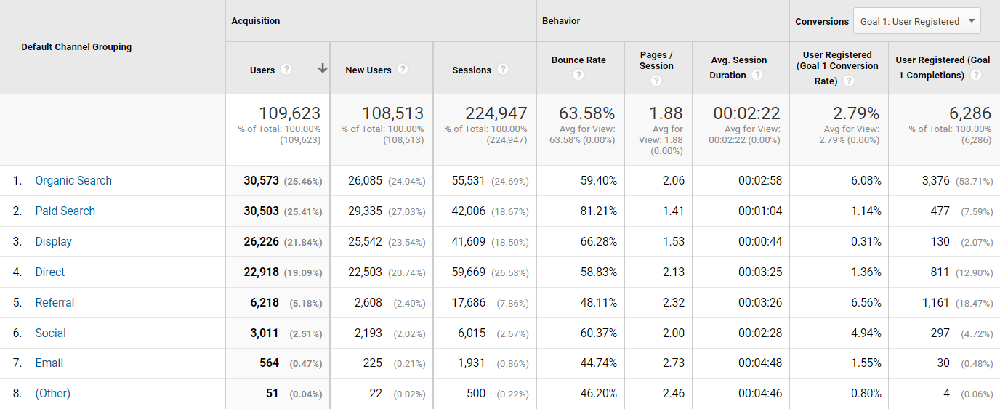

Growth
==========================

&nbsp;

**Growth Marketing Achievements from 2021**

  

Some highlights:

*   1 new team member - Alejandra Content Specialist in house 
    
*   1 **Hackathon** co-hosted with Flutterwave - 500 registrations - 19 final projects submitted - 3 winners
    
*   1 **Webinar** with Postman - 50  registrations 
    
*   Supported Success Team with 6 Onboarding webinars with the communication 
    
*   1 Workshop with Sales - Build Buyer Persona per Region 
    
*   35 **email campaigns** sent 
    
*   Connections and **profit control document** to understand key routes
    
*   10 ad hoc **promotions** that nurture Key Accounts relationships (Sales/ Solution Delivery/ Finance/ Design)
    
*   **Website** Structure and Content (in progress)
    
*   **Brandbook** (in progress)
    
*   **Sales Kit** (in progress)
    
*   14 SEO Optimized **Blog Post**
    
*   Growth Marketing Documentation with **SOP´s** per activity  
    
*   Sales **Trade Show** Process & Follow up: Before - During - After attending each - 14 Trade Shows Attended - Deals added to Pipedrive coming from Trade Shows (CRM): 61 
    
&nbsp;

**Relevant data from 2021**

  

WEBSITE:  
We received a total of 109,623 (more than one hundred nine thousand) users on the website.  70% growth compared to last year 2020. 

We had a total of 63,58% of bounce rate, most of it caused by the paid campaigns.

We registered 6,286 users coming from Google organic and paid efforts, being the organic & referral channels the highest in terms of conversion rates with 6,56% 

&nbsp;  

**CAC**

  

**Customer Acquisition Cost**

  

This metric allows us to understand how much investment it takes to acquire new clients.

  

This metric will be divided in separate acquisition channels as the CR from each one varies. The recommendations about investment will arise from these numbers. 

  

We will have these numbers coming from Pipedrive (CRM) so we need to follow up with the Sales Team in order to get everything updated before we start.

  

But first thing, first! Let´s review important questions:

&nbsp;  

**Which  are the acquisition channels?** 

  

Acquisition channels:

*   Trade shows
    
*   Referrals
    
*   Web Forms
    
*   Registrations
    

&nbsp;  

**Which channel is the most profitable one?**  
(This is based in the total revenue forecasted) 

1.  Referrals: 2.460.888
    
2.  Web Forms: 653.046
    
3.  Registrations: 125.138
    
4.  Trade Shows: 50.000
    

 &nbsp; 

**Which channel is the more convertional one?**

(This is based in the number of WON deals)

1.  Registrations (6)
    
2.  Referrals (4)
    
3.  Web Forms (2)
    
4.  Trade Shows (1)
    

 &nbsp; 

**Trade Shows:**

  

**Trade-shows KPI´s:**

We listed 23 trade shows in 2021, and be able to attend 14, we missed 9

  
&nbsp;

**Deals added to Pipedrive coming from Trade Shows (CRM): 61**

Pipeline forecast: 10.329.522,84 € Total Value/ 3.100.603,88 €·61 deals Weighted Value

  
&nbsp;

**Q3 2021:**

Deals added to Pipedrive (CRM): 10

2.077.742 € Total Value/ 585.818,20 € Weighted Value

  

Deal WON: Paymaster $50.000 usd

All Wireless & Prepaid Expo

  
&nbsp;

**Q4 2021:**

Deals added to Pipedrive (CRM): 48

Pipeline forecast: 2.270.621,24 Total Value/ €·551.693,12 € Weighted Value 

**Deals added to Pipedrive coming from the Registrations:**

 &nbsp;

**Q3 2021:**

Deals added to Pipedrive (CRM) 30

1.861.582,48 €·186.784,35 €·30 deals

Deals WON:

*   Boabab $0,00
    
*   Dafribank Digital $100,000
    
*   Xashpay $12,000
    

**TOTAL: $112,000**

  
&nbsp;

**Q4 2021:**

Deals added to Pipedrive (CRM) 29

118.386,32 € Total Value/ 11.838,63 €·29 deals Weighted Value 

Deal WON: Sea Monster $24,000

&nbsp;

**Next steps, ideas, plans: 2022**

  

The Growth Marketing tagline for 2022 will be: “Increase Qualified Leads into Sales Funnel”.

  

In order to do this we will continue with some of the activities we were doing during 2021 but we will work to optimize them, and include more experiments and hacks.

  

We will concentrate most of the activities in the TOFU (Top of the Funnel) by:  
 

*   Creating new partnerships like we did with Flutterwave and Postman with companies like Twilio, Stripe, Moesif, if you have contacts to refer to, feel free to reach out and make suggestions!
    
*   Contribute to build the Digital Developers Community around the world with special activities like webinars hackathon, videos, blog post contribution program and more.
    
*   Content strategy based on keywords and marketers to position first in the organic engine results (SEO) use cases, reports, white papers, landing pages, etc. Also if you want to write about any topic related to the industry and share expertise you are invited to send ideas.
    
*   SEM - Mostly for brand awareness, Promote events and strength the brand awareness by retargeting with Ads in Google
    
*   Drive traffic and relations through social media channels Twitter, Facebook, LinkedIn , YouTube.
    
*   Events - Sponsorships and brand awareness in the TOP events around the world
    
*   Work Closely with Finance to measure CAC in quarterly basis
    
*   Work Closely with Sales to follow up the CRM
    
*   Continue with the documentation for learning and process know how (for promotions, for email marketing, for special campaigns)
    
*   Work with reporting in monthly basis to follow up with KPI for each activity
    
*   Hire a Full Stack for the team to support in Website redesign and optimizations, Landing pages for promotions and products, Pixels and conversion tracking, SEO technical optimizations, Support with Amplitude funnel 
    

  
&nbsp;

**The team:** 

  

**Content Marketing:**

Activities involved

*   Webinars
    
*   Email Marketing Campaigns
    
*   Website landing pages
    
*   Sales Presentations and Documents
    
*   Copy for Ads 
    
*   Social Media Calendar
    
*   WP
    
*   Blog Post production and coordination with external freelancers
    
*   Link Building strategy
    
*   PR production 
    
*   Video production
    
*   Hackathons 
    
*   Product Sheets
    
*   Brandbook
    

&nbsp;

**Design Marketing:**

Activities involved

*   Webinars 
    
*   Email Marketing Campaigns
    
*   Website landing pages
    
*   Sales Presentations and Documents
    
*   Copy for Ads 
    
*   Social Media Calendar
    
*   WP
    
*   Blog Post production and coordination with external freelancers
    
*   Link Building strategy
    
*   PR production 
    
*   Video production
    
*   Hackathons 
    
*   Promotions
    
*   Brandbook
    

 &nbsp; 

**Full Stack:**

Activities involved

*   Website redesign and optimizations
    
*   Landing pages for promotions and products
    
*   Pixels and conversion tracking
    
*   SEO technical optimizations 
    
*   Support with Amplitude funnel 
    