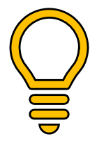

&nbsp;

Travel & Accommodation:

  

1.  The company will cover all the travel expenses that have been previously approved or requested by the CEO (only) through the travel form found on page 2.
    
2.  The Administrative Team will book accommodation, flight, and train tickets. Please provide the travel information within 15 days in advance.
    
3.  Taxis, meals, and expenses up to 100 EUR will be paid by the team member and will be submitted through reimbursement requests.
    
4.  Any expense of over 100 EUR has to be previously approved by the CEO.
    

Reimbursement Procedure:

  

1.  Reimbursements should be submitted every month through a report exported from the “Expensify” platform. The frame time is from day 01 to the last day of the month. We submit one report per month.
    
2.  Every expense registered in the report has to be filled up as follows: 
    
    1.  The description field has to specify details of the expense in a clear way.
        
    2.  Upload the ticket/Invoice scanned.
        
    3.  Submit this report to Administrative Team ([finance@reloadly.com](mailto:finance@reloadly.com)).
        
3.  Any expense of over 100 EUR has to be previously approved by the CEO.
    
4.  The payment of reimbursements will be processed during the second week of the next month.
    
&nbsp;

_**To Keep in mind:**_

  

_**We want to succeed as a company through all the effort that every team-member can bring. So, it is important to remember that every trip has to be related to measurable goals and achievable targets.**_

**Travel Form:**
================

|   |   |   |
|---|---|---|
| Submitted by:  |   |  |
| Date of Request:  |   |   |
| Travel Starts:  |   |    |
| Travel Ends:   |   |      |
| Destination:  |   |       |
| Accomodation days frame to be booked:  |   |      |
| Objectives to achieve in the travel:  |  |      |
|   |   |        |
|     |     |       |
|     |     |       |
| Additional Comments    |       |       |
|      |       |       |

  

**Submitted by:**

\_\_\_\_\_\_\_\_\_\_\_\_\_\_\_\_\_\_\_\_\_\_\_

Team Member: 

**Approved by:**

\_\_\_\_\_\_\_\_\_\_\_\_\_\_\_\_\_\_\_\_\_\_\_

CEO: Michel Francis

