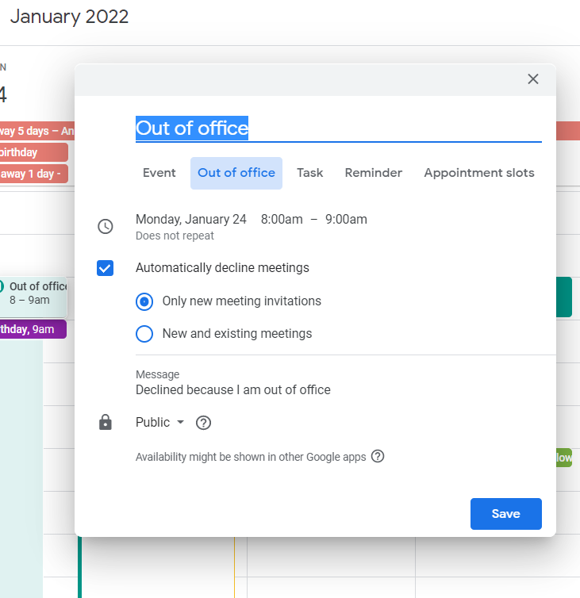

Out of Office set up policy
===============================================

&nbsp;

Once your leave (annual leave, sick leave, public holidays) is been approved via Factorial, you still need to set up some things to let people know and facilitate organising meetings and things around it. Mind Factorial is not linked to your calendar so **you need to block the dates you’ll be off.**

&nbsp;

*   **CALENDAR**
    

Go to your calendar and click on the day you’ll be off and on the time you’d start working, create and event choosing: **Out of office**, and set up the days and times so when somebody wants to invite you to a meeting, it’ll appear as you are off and they won’t be able to include you.

&nbsp;

*   **EMAIL**
    

**Mandatory**: To set up your email vacation responder to automatically notify people that you won't be able to get back to them right away. When people send you a message, they'll receive an email response containing what you've written in your vacation auto reply.

Instructions:

*   On your computer, open Gmail.
    
*   In the top right, click Settings Settings and then See all settings.
    
*   Scroll down to the "Vacation responder" section.
    
*   Select Vacation responder on.
    
*   Fill in the date range, subject, and message.
    
*   Under your message, check the box if you only want your contacts to see your vacation reply.
    
*   At the bottom of the page, click Save Changes.
    
&nbsp;

### **Share your out of office status**

To show others that you're out of office, [share your calendar](https://support.google.com/calendar/answer/37082) and [create an out of office event](https://support.google.com/calendar/answer/7638168). The event needs to span all day or extend past your working hours.

&nbsp;

*   **SLACK**
    

  
Same as email, we need to set up slack status to let people know we won’t reply.

&nbsp;

**Announce your status**

Let everyone know where you are and when you’ll be back by updating your custom status a few days before your planned departure, and during your time off. It appears everywhere your name does, including your user profile and any message you’ve sent in Slack. Illustrate it with an emoji to indicate that you’re offline or taking a road trip, and let people know the date when you’ll return in the status text.

How to do it?

It’s easy to set your status in all versions of Slack. From your computer, click on your name in the upper-left corner of your sidebar, then select Set a status. On our mobile apps, tap the You option on the bottom tab bar, then edit your status directly from there.

You can also set the expiration date and time of your message, so that your vacation status, for example, disappears when you’re back to work.

&nbsp;

#### **Leave notes in reminders**

[Reminders in Slack](https://slack.com/blog/productivity/never-forget-the-little-things-with-remind) are exactly that—messages reminding you or someone else to do anything you need at any future time or date you choose. Set them before you leave to remind yourself to do various things when you return, or ask others to set them for you if anything comes up while you’re gone. You can always ask Slack to remind you later about a particular message or conversation.

  