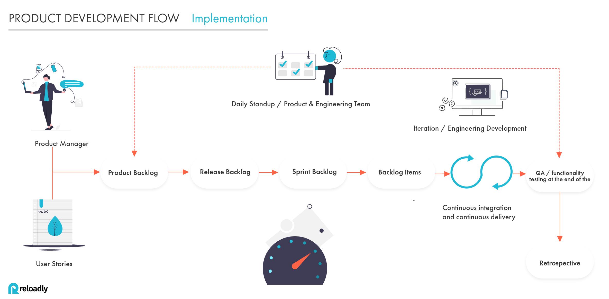
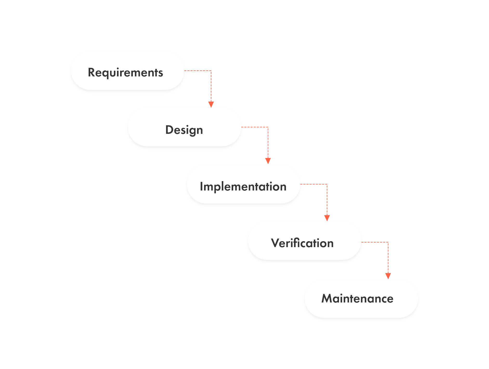
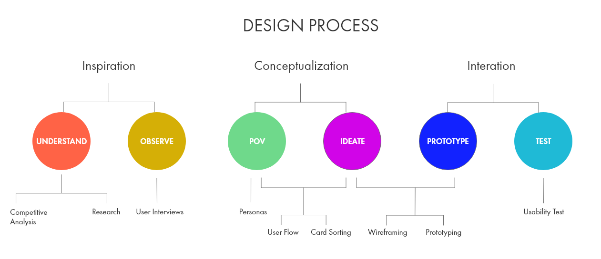
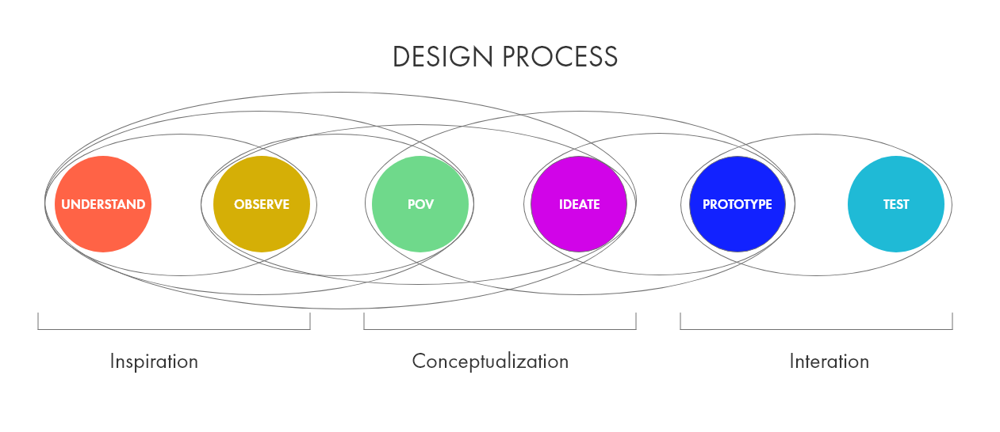

This section describes the standard operating procedure for the product team.

&nbsp;

Product Development Process
===========================

Team meetings
-------------

&nbsp;

### Product Sprint Planning ( Bi-weekly)

*   What: Bi-weekly to align next priorities, dependencies and discuss different topics related to new features, improvements, and bug fixing.
    
*   Who: Product Manager, UX/UI designers, and engineering team.
    
*   When: Every Tuesday noon CEST for 60min.
    
*   Format: Sprint planning is led by PMs and the Chief architect officer following CPO priorities focus in business needs.
    
*   Outputs: A confluence document is filled by PMs with users stories that all participants agree to deliver in the next 2 weeks.
    
&nbsp;

### Daily Scrum

*   What: Every day with 15min meeting to discuss progress in different projects.
    
*   Who: Engineering team and PMs.
    
*   When: Every day at 10 am CEST.
    
*   General topics to discuss
    
    *   What did you do yesterday?
        
    *   What will you do today?
        
    *   Anything blocking your progress?  
        
&nbsp;

### Backlog Grooming (Bi-weekly)

*   What: meeting of the Scrum team in which the product backlog items are discussed and the next sprint planning is prepared.
    
*   Who: Engineering team, PMs, Designers
    
*   When: Every two Friday 12h CEST (60min). this is a flexible meeting depending on Engineering availability and how many stories has been groomed in the last grooming meeting.

 &nbsp;   

### Sprint Retrospective (Bi-weekly)

*   What: a timeboxed meeting that takes place after the sprint review and before sprint planning.
    
*   Who: engineering team, PMs, Designers
    
*   Format: In this meeting, we discuss topics and create action points that we would like to start/stop and continue doing taking as a reference last sprint experience.
    
*   When: Every two Mondays 12h CEST (60min).
    
&nbsp;

## Product Development Flow

### Achieve product success.

Reloadly Product managers take into consideration Quality and Quantity to approach and measure Product development success before, during, and after the product development Flow.

All decisions for the next product development are defined by different methods: Benchmarking, Users surveys, and product prototyping

&nbsp;

Feature Development Process
---------------------------

&nbsp;

### New Feature Development

*   All new Feature development can be defined by CPO,PMs, or CTO/CAO.  
    
*   Each new development must follow company objective. (ex. Increase MAUs)  
    
*   Once the concept is defined the process will be followed in the next stages:
    
&nbsp;

### PRDs

PMs must define product requirements related to the project with Acceptance criteria, functional and non-functional requirements and UX/UI wireframes and prototypes.  

&nbsp;

### Design

UX/UI designs requirements need to be defined by the designer, PMs and also Frontend developers if need it.  

&nbsp;

### Project grooming

Once all the requirements are defined, PMs and the Engineering team must define project complexity.  

&nbsp;

### Implementation

Once the Backlog is groomed, defined and kicked off, PMs and the development team must assure to complete in the next sprint the stories related to the project focuses to release the minimum viable product.  

&nbsp;

### Verification

Development team along with QA engineer must verify product functionality before the feature is deployed to production. this will ensure that our deployments won't affect our current system and will ensure that the development achieves all product requirements and expectations.

&nbsp;

### Maintenance

The engineering team hand in hand with customer support and product will guarantee product stability.

&nbsp;

### Documentation updates

Documentation updates: If the feature impact Reloadly’s API requests or responses, [Reloadly Developers](https://developers.reloadly.com/) must be updated along with the deployment to production environment.

&nbsp;

Providers/Routes Integration Process
------------------------------------

&nbsp;

### Prepaid Services

Prepaid Service providers need to be defined and planned by the procurement/sales team and PMs. The following steps are used when integrating a provider:

*   For each new provider,/route, a sales representative has to guarantee that the defined prices are negotiated and approved between Reloadly and the supplier/operator.
    
*   Each new provider/route integration needs to be prioritized in Integration boards by COO and PMs
    
*   Once the technical integration starts, a communication channel must be established between all parties. this is to ensure that technical questions related to the integration can be clarified and developed in a short period of time. (Microsoft Teams, Slack, WhatsApp, Skype, etc.)
    
*   Each integration must follow the Development stages: To-do → In progress → Code review → QA → Ready for PROD → Released.
    
*   If the integration process is affected by some internal or external factor, all stakeholders related to the project must be informed in order to unblock the process and move forward with the integration.
    
*   Once the technical integration is completed, PMs must inform all stakeholders involved in the project.
    
*   PMs and the finance team must set up standard pricing related to the provider/route integration.
    
&nbsp;

Design Process
--------------

At Reloadly we follow a design thinking process. This is not a linear process, but a circular one. We can turn from Prototyping to POV or Ideate, from POV back to Understand and so on.

One of the first steps is to understand the problem. This includes conducting a competitive analysis and research. Designer and Project Manager look at what solutions to similar problems have been proposed and make an assessment of the strengths and weaknesses of the competitors. Part of the research is also analyzing data from the current services, like retention.

As part of the Observation process, the Designer will conduct interviews in order to gather qualitative information directly from people engaged to Reloadly's products. The designer develops a script of questions, recruits participants and records the results. This is a way to get direct feedback from the current or potential users. The focus is on how to formulate effective questions and best interview practices.

After organizing the information, the Designer will proceed to persona creation. User persona helps us better understand user demographics, needs, goals, emotions, behaviors, fears, and limitations of our users. Then we map out user flows by using information architecture techniques like card sorting.

After mapping user flows, the Designer and the Product Manager brainstorm solutions for each task that the user needs to complete. Wireframes (blueprints initially) are created, as well as the first prototypes. Then we conduct usability tests. With the results, we go back to designing and then prototyping and then testing again.

### Bugs reporting and fixes

*   Every Reloadly Team member must notify Product and Engineering team of any bug reported by a user or by another Reloadly team member.
    
*   Product and engineering team must create a ticket related to the bug to track the progress.
    
*   The Fix will be communicated to stakeholders involved in the issue.
    
*   The bug needs to be solved within the next 2h.
    
*   Engineering and Product team would prioritize these over BAU work.
    
&nbsp;

### QA usability testing

*   All development QA must be performed using a staging environment.
    
*   All QA must follow a complete usability checklist.
    
    *   Signup / Login.
        
        *   Account verification.
            
        *   Pricing management.
            
        *   Admin and Developer portal management (custom pricing, transaction report, standard pricing, user information, etc.) .
            
        *   API request and responses.
            
        *   Notification methods (email, SMS, slack notification)
            
        *   Moesif API requests and responses.
            
*   All QA results must be added to the Jira user stories.
    
*   In case that QA is not successfully finished, the feedback must be updated in the Jira ticket and informed to the developers related to the user story.
    
*   Once the QA is finished and approved, the feature, improvement, or bug fixing is ready to go to production environment.
    
&nbsp;

### Definition of Done

DONE = Releasable. A feature, improvement or bug fixing is defined as DONE once it covered the next requirements:

*   Business or Functional requirements.
    
*   Quality.
    
*   Non-Functional Requirements.
    
*   Availability.
    
*   Maintainability.
    
*   Performance.
    
*   Reliability.
    
*   Scalability.
    
*   Security.
    
*   Usability.
    
*   Compliance/Regulatory.
    
*   Legal.
    
&nbsp;

### Product Categorization

*   **Airtime**: Airtime minutes refer to the minutes you have available to talk on the phone. Reloadly API help developers to boost their application with an easy API solution.
    
*   **e-Gift cards**: Prepaid solution with a certain amount of money by the one who gifts it.
    
*   **Number Lookup**: Mobile number portability enables mobile telephone users to retain their mobile telephone numbers when changing from one mobile network carrier to another.
    
*   **Utility payments (under development)**: Utility payments service (electricity/water/television).
    
&nbsp;

Communicating with the Product Team
-----------------------------------

Communicate with Reloadly’s product Team is easy, if you would like to interact with the product team feel free to contact us via:

Platform

Details

Developer Slack Community

[https://reloadly-developers.slack.com/ssb/redirect](https://reloadly-developers.slack.com/ssb/redirect)

Email

[support@reloadly.com](mailto:support@reloadly.com)  
[hello@reloadly.com](mailto:hello@reloadly.com)

