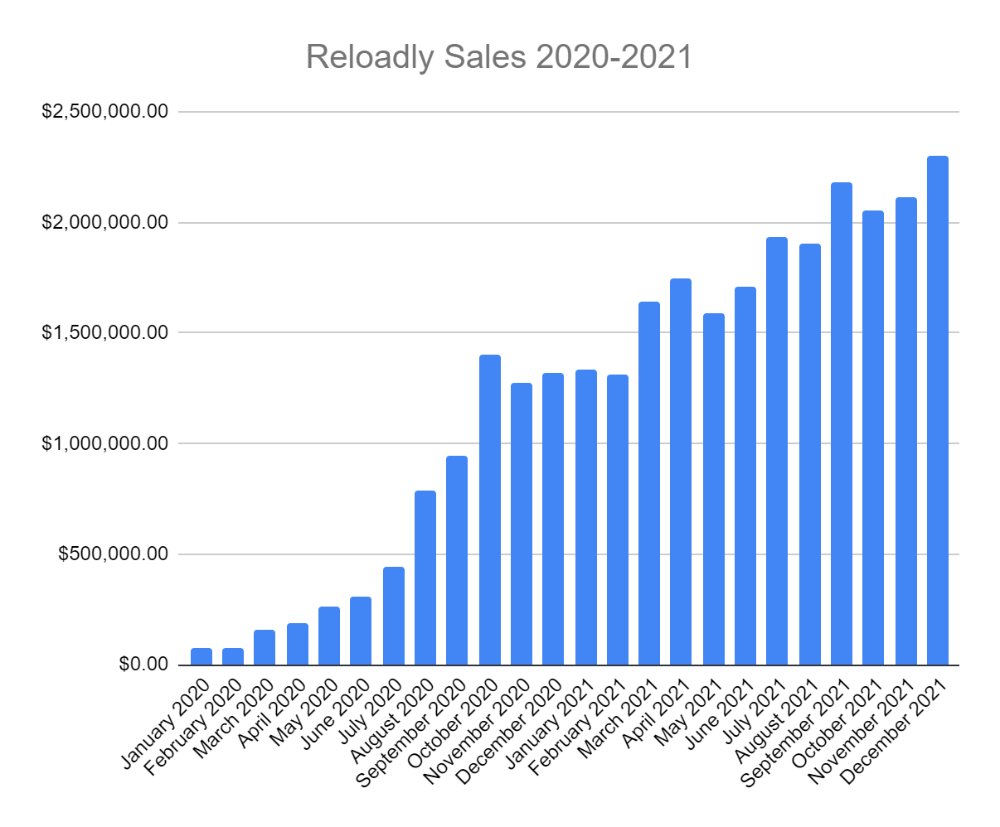

Commercial Team - 2022 Strategic Planning
==============================

&nbsp;

## Version History

&nbsp;

| Date        | Changes       | Author            | Version |
|-------------|---------------|-------------------|---------|
| 20-Dec-2021 | Initial Draft | Enrique Hirlemann | 0.1     |
|             |               |                   |         |

  

  
&nbsp;
  

  

  

2021 OKR Results & Takeaways
============================

&nbsp;

**OKRs**

**Achievement**

**Notes**

&nbsp;

| **OKRs**                                                                   | **Achievement** | **Notes** |
|----------------------------------------------------------------------------|-----------------|-----------|
| **Form a Solid Sales-driven growth team**                                     |                 |           |
| Q1 Goal: Build a pipeline of qualified leads to reach $5M MRR projections  | 105%            |By the end of Q1, we’d surpassed our pipeline goal of $5M MRR in total by 5%.     Now, at the end of 2021, we have deals currently in the “Integration” stage alone that represent over $4.5M MRR.    Pipeline deals currently under “Negotiation” represent an additional $9M+ MRR, and    Pipeline deals in “Early Engagement” represent another $7.2M MRR in potential          |
| Close 6 key accounts with an average of $75k ARPU                          |50%             | Since the beginning of 2021, we’ve only launched 6 new accounts with a greater than $50K impact each.    Some other, more recent launches (like blockstore and Unipay), have yet to ramp up their impact          |
| Hold 8 training sessions with team on best practices for closing deals     | 75%             |  We began to do this early in Q1 but have not kept the practice constant throughout the year.   It’s a good practice to revive but only with a narrow, specific “practice” per session. General sessions of overall “best practices” would likely not be particularly impactful.         |
| **Increase Monthly Sales Volumes**                                            |                 |           |
| Q1 Goal: Recruit 3 more sales members to our team (USA, Middle East, etc.)  Q2 Goal: Stand up a team of 4 new, qualified people in sales, support & marketing |                 |  We’ve actually grown the sales team by a headcount of 5 this year, not including our recent restructuring.  The Customer Success & Marketing teams have grown by another 5        |
| Q1 Goal: Increase monthly sales from $1.375M to $1.875M                                                                           |       70%          |  We were 30 percent below our target revenue target for Q1 and after a few months ahead of target and a few months below, we’re actually ending the year at about the same 30 percent deficit.  We’ve grown nearly $1M MRR over the course of the year but we’re still short of our $3M MRR, expecting to finish the year with about $2.3M in Dec.         |
|    Q1 Goal: Increase online sign-up conversions from 4% to 8%  Q2 Goal: Increase online sign-up conversions from 6% to 10%                                                                       |    100%             |  Our conversion percentage actually reached as high as 11% by April 2021 but the metric became distorted in August.  This metric needs to be cleaned up in our recurring reporting and dashboards         |
| **Improve our Operational Processes**                                                                           |                 |           |
|   Produce an operations manual wiki work process for 4 departments (Engineering, Opps, Commercial, & Product)                                                                         |   62.5%              |    Customer Care Ops and Product manuals were done in Q1. Sales was only half finished by then.  Engineering was developed independently.       |
|  Implement 18hr/24hr tech support & close tikets within 2hrs                                                                          |  100%               |     Done  Next stage: 24/7      |
|   **Rockstar Revenue Growth**                                                                        |                 |           |
|   By Q3 &Q4 we’d evolved the Biz Dev portion of the Sales’ Team OKRs to the below targets:         200 pre-screened qualified leads                                                                   |  120%               |  We added nearly 240 new leads in Q4 alone, but that only accounts for about 66% of the target         |
|  Increase monthly revenue from $2.2M to $3.0M USD                                                                          |     15%            |  10 new accounts live in Q4 but traffic still not reflected in this month’s volumes         |
|   Achieve 7% avg gross margin                                                                         |    77%             |     Currently @ 5.4%      |
|                                                                            |                 |           |

&nbsp;

## Key Achievements - 2021

&nbsp;

&nbsp;

| **Achievements** | **Impact** |
|------|------|
|  Grew MRR by about $1 Million USD over the course of 2021    | Significant YoY growth but still short of our 2021 annual targets     |
| Grew customer base 45% (up from 165 to 270)      | Continued validation of core developer-focused business model     |
| Developed pipeline of accounts worth over $240M in annual revenue      | We’re gonna crush 2022     |
|  Restructured commercial organization into new, regional teams    |  Leverage regional expertise, improved customer experience for account management, easier cultural negotiations, leverage regional contacts.    |
|  Hiring and training of new team members    | 	
Scaling team to meet growth goals     |
| Formalized new corporate salary range structure with HR     | More “fair” compensation tiers, better transparency and happier employees     |
|  Created new internal reporting for CS team     | Easier visibility for management team of ongoing efforts and issues     |
| Created new reporting formats for weekly sales team’s updates for management (expect draft 1.0 to be rolled out this week)      |  These new reports will result in better control, easier tracking, improved visibility and more data-driven updates than before    |
|  Created new bonus structure for commercial team    | Better motivate team, reward behavior that truly drives growth, move away from bonuses tied to OKRs (not best practice).     |
|      |      |

&nbsp;

2022 - Next Steps
=================

  

The role for the teams comprising the commercial areas of the company are straight forward. We grew Reloadly’s MRR 2X from 2020 to 2021, we now need to focus on growing 3X from 2021 to 2022. To reach that objective, we need to implement various changes and improvements that can impact our sales performance worldwide. These action items and initiatives can be divided into three categories:

  

1.  **Business Development** - These are initiatives and improvements that will help increase the number of prospects with whom we engage and that will make that engagement more likely to result in them wanting to integrate with Reloadly as their preferred supplier of digital products.
    
2.  **Integration** - Once we’ve successfully convinced a prospect of the value in working together, we need to get them live and selling as quickly as possible. This, more than anything else, will be the number one focus for the commercial teams in Q1 2022. 
    
3.  **Account Management** - Once each new account is live we need to help them reach their sales potential and ensure we remain engaged and relevant to retain, grow and monetize each relationship.
    

  

The one area that impacts both Business Development and Account Management is hiring. Hiring for key outstanding roles will begin in Q1 and be an ongoing effort for the next few months. Our goal will be to have all commercial roles filled by the end of Q2 2022.

&nbsp;

## 2022 Focus Areas

&nbsp;

### Business Development

&nbsp;

| **Focus Area** | **ETA** | **Impact** |
|------|------|------|
| Create new Sales kits     |  2022 Q1    | Improved initial pitch and faster understanding of our value proposition     |
| Create new industry-specific use cases     | 2022 Q1     | Create more excitement and a sense of urgency to go live on the part of the new account     |
| Coordinate regular meetings between Sales and Procurement Teams to strategize product pricing and positioning tactics     | 2022 Q1 Ongoing     | Drives better understanding and use of product-related competitive advantages     |
|           |                   |

&nbsp;

### Integration

&nbsp;

| **Focus Area** | **ETA** | **Impact** |
|------|------|------|
|  Introduce new Integration Process Plan template    |  2022 Q1    | Easily track integration process for all new accounts to quickly identify and address any potential delays.     |
| Help create a detailed launch kit (for new accounts)      | 2022 Q1     |  Kit will clearly lay out the expected launch cycle, projected timing, benefits to account, and upcoming marketing opportunities once live.    |
|      |      |      |

&nbsp;

### Account Management

&nbsp;

| **Focus Area** | **ETA** | **Impact** |
|------|------|------|
| Implement new reporting and closer data-driven reviews of all accounts     |  2022 Q1    | Drive better transparency and accountability  More easily identify and address issues up front  Keep better track of traffic going to direct connections and help prioritize optimizing these routes     |
| Create new template for quarterly account reviews with all key accounts (in addition to regular, ongoing AE follow-ups)     |  2022 Q1    | Improve Customer experience  Drive increased volumes proactively  Improve retention and reduce risk of competitive poaching     |
| Begin weekly training schedule for entire sales team     | 2022 Q1 Ongoing     | Constant improvement of skills or awareness  Trainings will range from inter-departmental resources to product trainings     |
|       |       |
  

