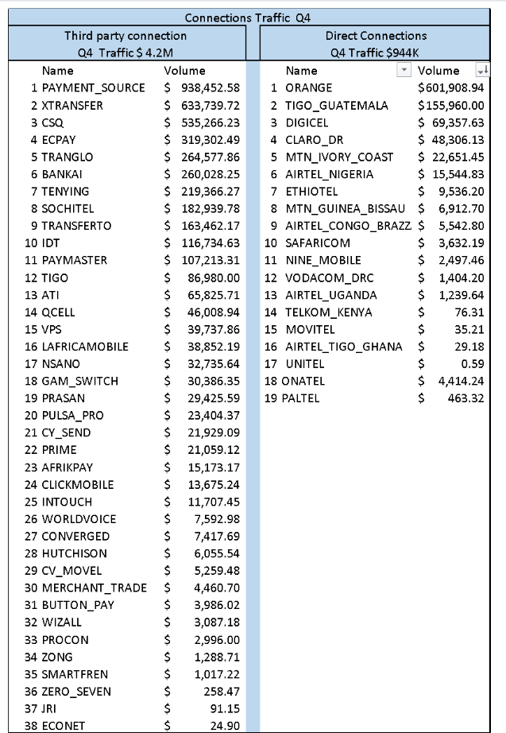
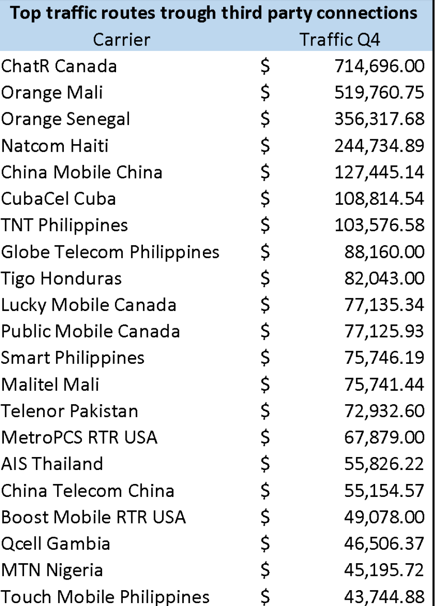
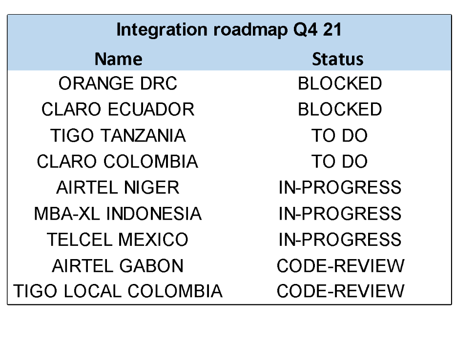

---
title: Carriers & Providers
author: Jean-Olivier Buteau
email: mailto:jbuteau@reloadly.com
image: https://ca.slack-edge.com/T8XB4CHJQ-U96MAE56E-gf1362f41038-512 
---  

Carriers & Providers
========================================

&nbsp;

Carriers & Providers Category

Strategic Planning 

2022

Version History

Date 

Changes

Author

Version

17-Dec-2021

Initial Draft

Tulita

0.1

&nbsp;

**Improvement Opportunities**
-----------------------------

|Opportunity   |  Impact |
|---|---|
| Go to market plan of new routes, better coordination and execution  | Sales team generating leads /traffic according to the active routes  |
|Driving traffic to directs routes to avoid any agreement cancelation   | Increase Reloadly sales and strengthen carrier relationship    |
| Minimize dependency of third party connections   | Pricing and GM improvements (rates, forex and routes), %  |
|Stabilize our route services in the main corridors   | Quality and tickets improvement: Less outages, less customers complains.   |
| Initiatives and  MDF (Marketing Development Funds) assigned by carriers + other promotions + tools   | MK Plan to support our main segments, channels, and customers.   |
| Visibility and OKRs   | Tracking on time the performance of every route/ corridor  |
| Speed integration process to go live in no more than three months   |Expand our corridors portfolio and be able to compete in equal conditions in key projects for tier1 accounts.     |
|   |   |

 

  
&nbsp;

**Strategic Plan** 
===================

This category will be the main point of contact and responsible for build and develop relationships with providers including carriers across all the regions.  

  

Consistently identify and negotiate new opportunities, markets  or business lines (Mobile Wallets, Bill payments, Bilateral alliances etc.)  while supporting and increasing traffic for existing agreements with carriers & providers 

Provide accurate and timely carriers updates, reporting and forecasts to take decisions and lead the internal communication to drive overall success in the go to market plan. 

&nbsp;

**Planned tactic actions** 

  

1.  **Structure & performance management:**   A team to develop business relationships and business plans with carrier & providers  that maximizes Reloadly advantages  to compite  into different segments in all regions. 
    

Drive any opportunity or challenge in the market that could impact our customer service and traffic. Also manage the visibility of Reloadly sales performance according to internal expectations and commitments in the agreements to avoid disputes or canceled contracts. 

1.  **Initiatives to prioritize our direct connections:** Currently +80% traffic is going through third party provider but most of our live direct connections doesn’t match with our demanded routes. (Annex Table 1) 
    

Implementing an aggressive direct agreements plan based in our Top 20 corridors and accelerate the integration process will help Reloadly to improve our cost and GM ~ 4%,  better quality service and pricing proposals.  

1.  **Best practices to generate traffic for live connections:**  The first key step is to identify the big accounts that have an existing demand for our direct connections, that will help us to growth revenues and carrier targets in the short term, also determinate new use cases or segments with potential traffic such as: Exchange, games, rewards, crypto currencies, etc. 
    

Then prepare a go to market plan  based in the diaspora corridor for every operator and a marketing initiatives for our tier 1 leads and to upsell existing accounts.

&nbsp;

**2022 Focus Areas**
--------------------

1.  Structure & Performance management 
    
| Focus Area  | ETA  | Impact  |
|---|---|---|
|OKRs   | 2022 Q1   | Increase Traffic for live operators. (Annex Table 1)    New agreements for direct connections based in Top 20 corridors.    Go to market plan for all live operators    Mk proposal for tier 1 accounts    GM improvement  |
| Business analysis  | 2022 Q1  | Visibility and tracking reports per operator, providers, customer, and GM   Operator reports  |
|   |   |   |

  
&nbsp;

**Initiatives to prioritize our direct connections**
    
| **Focus Area** | **ETA** | **Impact** |
|------|------|------|
| New carrier negotiation based in Top 20 corridors in collaboration with legal team     | 2022 Q1     |  New operators agreements for local and international products in key corridors: China, Mali, Senegal, Philippines, Cuba, CENAM, Pakistan etc.     New markets opportunities and segments.    Bilateral alliance with  5 key providers; Tranglo, Dtone, Bankai, Suchitel, CSQ    (Annex Table 1 and 2)    |
|  Onboarding procedures for new agreements     | 2022 Q1     | Create flow of new direct connection since the negotiations to go live.    Jira carpet with all documents necessary for legal, tech and financial team.     |
|Accelerate the Integration roadmap in collaboration with tech team      |  2022 Q1    | Prioritize the pending integration in all regions (Annex Table 3)      |
|      |      |      |

  

&nbsp;
  

**Best practices to generate traffic for live connections**
    
| **Focus Area** | **ETA** | **Impact** |
|------|------|------|
| Go to Market Plan new routes working close with the Sales team     | 2022 Q1     | Main corridors, key potential customers, competitors, market share, Market plan     |
| Marketing Strategies for Tier 1 accounts, in collaboration with MK team      | 2022 Q1     |  Marketing funds from Operators    Initiatives plan to go live    PR    Communication in social media    Special promos     |
| Tools proposal to the operator to improve ARPU and new users rates        |  2022     | Zero Balance   Top up request    Calling backtone for International    SMS blast to local prepaid base     |
| Pricing in collaboration with Finance team     | 2022      | Special rates for the launching period    Remove deductions for the first week of new customers      |
|      |      |      |
    

**ANNEX**

&nbsp;

Table 1 - Providers & Direct Connections Traffic Q4 / 21

  

&nbsp;
Table 2 – Top 20 demanded corridors Q4 / 21

  

&nbsp;
Table 3 - Integration Roadmap Q4 / 21

  

